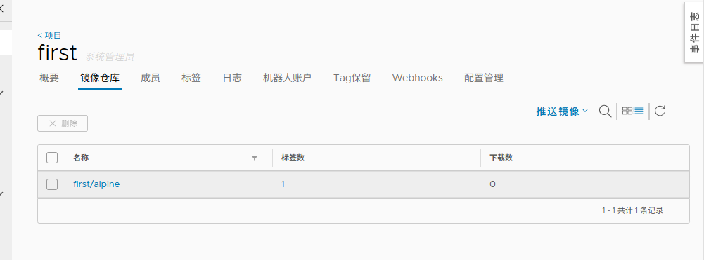

# Harbor 私有镜像仓库部署

## 一、Harbor 安装部署

### 准备安装包

```bash
harbor-offline-installer-v1.9.0-rc1.tgz
```

---

### 安装步骤

```bash
# 1. 解压安装包
cd /opt && tar -xf harbor-offline-installer-v1.9.0-rc1.tgz

# 2. 进入安装目录
cd harbor/

# 3. 编辑配置文件
vim harbor.yml
# hostname: 10.0.0.200
# harbor_admin_password: Harbor12345

# 4. 执行安装脚本
./install.sh

# 5. 访问 Harbor
# URL: http://10.0.0.200:80
# 用户名: admin
# 密码: Harbor12345

# 6. 新建项目 first
```

---

## 二、配置 Docker 客户端

### 修改宿主机 Docker 配置

```bash
vim /etc/docker/daemon.json
{
  "registry-mirrors" : [
    "https://ms9glx6x.mirror.aliyuncs.com"
  ],
  "insecure-registries":["http://10.0.0.200"]
}

systemctl daemon-reload
systemctl restart docker
```

**注意事项**：

- 注意这里的端口，可能有其他容器抢占 Harbor 在宿主机对应的端口
- `docker update --restart=no image1` 可关闭某自动跟随 Docker 重启的容器

---

## 三、推送镜像到 Harbor

### 推送本地镜像

```bash
# 1. 标记镜像
docker tag alpine:latest 10.0.0.200/first/alpine:latest

# 2. 登录 Harbor
docker login 10.0.0.200
# 用户名: admin
# 密码: Harbor12345

# 3. 推送镜像
docker push 10.0.0.200/first/alpine:latest
```



---

## 四、Harbor 管理命令

### 停止运行

```bash
# 停止 Harbor
docker-compose stop
```

---

### 启动 Harbor

```bash
# 启动 Harbor
docker-compose start
```

---

### 重启 Harbor

```bash
# 重启 Harbor
docker-compose restart
```

---

### 停止并删除容器

```bash
# 停止并删除容器
docker-compose down
```

---

### 停止并删除容器及数据

```bash
# 停止并删除容器及数据
docker-compose down -v
```

---

## 五、Harbor 常用操作

### 拉取镜像

```bash
# 拉取镜像
docker pull 10.0.0.200/first/alpine:latest
```

---

### 搜索镜像

```bash
# 搜索镜像
docker search 10.0.0.200/first/alpine
```

---

### 删除镜像

```bash
# 删除本地镜像
docker rmi 10.0.0.200/first/alpine:latest

# 在 Harbor 界面中删除镜像
```

---

## 六、Harbor 项目管理

### 创建项目

1. 登录 Harbor 界面
2. 点击"项目" → "新建项目"
3. 填写项目名称（如 first）
4. 选择项目可见性（公开/私有）
5. 点击"确定"

---

### 添加用户

1. 点击"用户管理" → "新建用户"
2. 填写用户信息
3. 设置用户角色

---

### 分配权限

1. 进入项目设置
2. 点击"成员"
3. 添加用户并分配角色（开发者/维护者/访客）

---

## 七、Harbor 高级配置

### 配置 HTTPS

```bash
# 1. 生成证书
openssl genrsa -out ca.key 4096
openssl req -new -x509 -days 365 -key ca.key -out ca.crt

# 2. 编辑 harbor.yml
vim harbor.yml
# https:
#   port: 443
#   certificate: /your/certificate/path
#   private_key: /your/private/key/path

# 3. 重新配置
./prepare
docker-compose down -v
./install.sh
```

---

### 配置存储后端

```bash
# 编辑 harbor.yml
vim harbor.yml
# storage:
#   s3:
#     accesskey: <access_key>
#     secretkey: <secret_key>
#     region: <region>
#     regionendpoint: <endpoint>
#     bucket: <bucket_name>
```

---

### 配置镜像复制

1. 在目标 Harbor 创建项目
2. 在源 Harbor 配置复制规则
3. 设置复制策略（手动/定时）
4. 测试复制功能

---

## 八、Harbor 备份与恢复

### 备份数据

```bash
# 备份数据库
docker exec -i harbor-db mysqldump -uroot -pHarbor12345 registry > /data/backup/registry.sql

# 备份配置文件
cp harbor.yml /data/backup/
cp /data/secretkey /data/backup/
cp /data/ssl/* /data/backup/
```

---

### 恢复数据

```bash
# 恢复数据库
docker exec -i harbor-db mysql -uroot -pHarbor12345 registry < /data/backup/registry.sql

# 恢复配置文件
cp /data/backup/harbor.yml .
cp /data/backup/secretkey /data/
cp /data/backup/* /data/ssl/

# 重启 Harbor
docker-compose down -v
./prepare
./install.sh
```

---

## 九、Harbor 监控与日志

### 查看日志

```bash
# 查看 Harbor 日志
docker-compose logs -f

# 查看特定服务日志
docker-compose logs -f harbor-core
docker-compose logs -f harbor-jobservice
```

---

### 监控 Harbor

1. 使用 Prometheus + Grafana 监控 Harbor
2. 配置 Harbor 指标导出
3. 设置告警规则

---

## 十、Harbor 故障排查

### 常见问题

**1. 登录失败**

```bash
# 检查 Harbor 服务状态
docker-compose ps

# 检查日志
docker-compose logs harbor-core
```

---

**2. 镜像推送失败**

```bash
# 检查 Docker 配置
cat /etc/docker/daemon.json

# 检查网络连接
ping 10.0.0.200
telnet 10.0.0.200 80
```

---

**3. Harbor 无法启动**

```bash
# 检查端口占用
netstat -tunlp | grep 80

# 检查磁盘空间
df -h

# 检查日志
docker-compose logs
```

---

### 清理 Harbor

```bash
# 清理未使用的镜像
docker system prune -a

# 清理 Harbor 数据
docker-compose down -v
rm -rf /data/*
```
