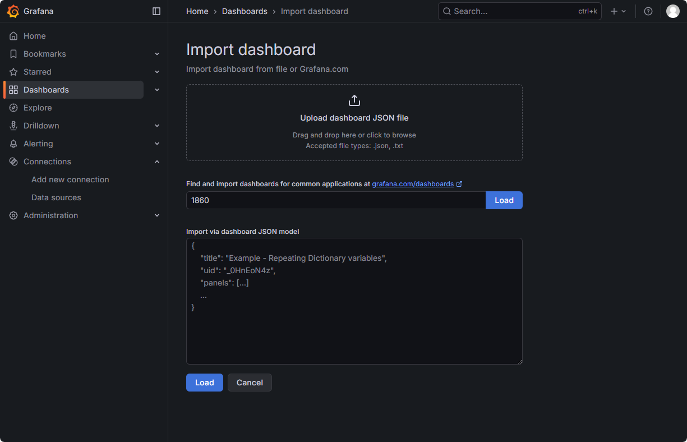

## 一、Grafana概述

### 1.1 核心功能

- **数据可视化**：将多种数据源数据以图表和仪表盘形式展示
- **多数据源支持**：Prometheus、InfluxDB、Graphite、Elasticsearch等
- **警报系统**：设置规则监控异常并通知
- **扩展性**：丰富的插件系统和API接口

### 1.2 与相关工具对比

| 工具           | 数据类型       | 主要用途             | 数据源                 |
| :------------- | :------------- | :------------------- | :--------------------- |
| **Grafana**    | 时间序列数据   | 监控、运维可视化     | Prometheus、InfluxDB等 |
| **Kibana**     | 非时间序列数据 | 日志、事件分析       | Elasticsearch          |
| **Prometheus** | 时间序列数据   | 数据采集、存储、告警 | 自采集                 |

## 二、Grafana + Prometheus监控组合

### 2.1 架构关系

```
数据流向：采集 → 存储 → 可视化
Prometheus：数据采集 + 存储 + 告警规则
Grafana：数据可视化 + 告警管理
```

### 2.2 工作流程

1. Prometheus采集各节点指标
2. 存储到时间序列数据库
3. Grafana通过PromQL查询数据
4. 可视化展示和告警通知

---

## 三、Kubernetes部署详解

### 3.1 部署文件解析

grafana-all.yaml

```yaml
kind: PersistentVolumeClaim
apiVersion: v1
metadata:
  name: grafana
  namespace: monitor
spec:
  accessModes:
    - ReadWriteOnce
  storageClassName: nfs
  resources:
    requests:
      storage: 20Gi
---
apiVersion: apps/v1
kind: Deployment
metadata:
  name: grafana
  namespace: monitor
spec:
  selector:
    matchLabels:
      app: grafana
  template:
    metadata:
      labels:
        app: grafana
    spec:
      volumes:
      - name: storage
        persistentVolumeClaim:
          claimName: grafana
      securityContext:
        runAsUser: 0
      containers:
      - name: grafana
        image: grafana/grafana:12.3
        imagePullPolicy: IfNotPresent
        ports:
        - containerPort: 3000
          name: grafana
        env:
        - name: GF_SECURITY_ADMIN_USER
          value: admin
        - name: GF_SECURITY_ADMIN_PASSWORD
          value: admin
        readinessProbe:
          failureThreshold: 10
          httpGet:
            path: /api/health
            port: 3000
            scheme: HTTP
          initialDelaySeconds: 60
          periodSeconds: 10
          successThreshold: 1
          timeoutSeconds: 30
        livenessProbe:
          failureThreshold: 3
          httpGet:
            path: /api/health
            port: 3000
            scheme: HTTP
          periodSeconds: 10
          successThreshold: 1
          timeoutSeconds: 1
        resources:
          limits:
            cpu: 150m
            memory: 512Mi
          requests:
            cpu: 150m
            memory: 512Mi
        volumeMounts:
        - mountPath: /var/lib/grafana
          name: storage
---
apiVersion: v1
kind: Service
metadata:
  name: grafana
  namespace: monitor
spec:
  type: ClusterIP
  ports:
    - port: 3000
  selector:
    app: grafana

---
apiVersion: networking.k8s.io/v1
kind: Ingress
metadata:
  name: grafana
  namespace: monitor
spec:
  ingressClassName: nginx
  rules:
  - host: grafana.qwe.cn
    http:
      paths:
      - path: /
        pathType: Prefix
        backend:
          service:
            name: grafana
            port:
              number: 3000
```

### 3.2 部署命令

```bash
# 应用配置
kubectl apply -f grafana-all.yaml

# 检查PVC绑定
kubectl -n monitor get pvc
kubectl get pv

# 检查Pod状态
kubectl -n monitor get pods
# 检查ingress状态
kubectl -n monitor get ingress
```

---

## 四、Grafana使用指南

### 4.1 访问与登录

- **地址**：[http://grafana.qwe.cn](http://grafana.qwe.cn/)
- **用户名**：admin
- **密码**：[admin](https://admin/)


Login  → 提示修改密码 改为了qweqwe

### 4.2 添加prometheus数据源

1. 进入 **Connection → Data Sources**

2. 选择 **Prometheus**

3. 配置参数：

   ```
   URL: http://prometheus:9090
   ```

   


如果HTTP请求没拿到数据可改为GET


### 4.3 导入Dashboard模板

#### 常用模板推荐：

1. **Node Exporter**：ID   1860
   - 展示节点资源使用情况
   - CPU、内存、磁盘、网络监控
2. **监控模板**
   - https://grafana.com/grafana/dashboards/
   - 搜索关键词：`kubernetes`
   - 根据需求选择合适的模板

#### 导入步骤：





### 4.4查看metrics


---

## 五、Kubernetes监控插件

### 5.1 DevOpsProdigy KubeGraf插件

#### 插件特点：

- 专为Kubernetes监控设计
- 可视化集群资源使用
- 支持Pod、Deployment、Service等资源监控
- 预定义多个仪表板

#### 安装步骤：

```bash
# 进入容器安装
kubectl -n monitor exec -it grafana-67657f994d-4l245 -- bash
grafana-cli plugins install devopsprodigy-kubegraf-app

# 退出容器
exit
# 重启deployment或者删除pod使其自动重建生效
kubectl -n monitor delete pod grafana-pod

[root@k8s-master-10 /kube/prometheus/grafana]#kubectl -n monitor exec -it grafana-67657f994d-4l245 -- bash
grafana-67657f994d-4l245:/usr/share/grafana# grafana-cli plugins ls
Deprecation warning: The standalone 'grafana-cli' program is deprecated and will be removed in the future. Please update all uses of 'grafana-cli' to 'grafana cli'
installed plugins:
grafana-pyroscope-app @ 1.16.0
devopsprodigy-kubegraf-app @ 1.5.2
grafana-exploretraces-app @ 1.3.0
grafana-lokiexplore-app @ 1.0.34
grafana-metricsdrilldown-app @ 1.0.29
grafana-piechart-panel @ 1.6.4
grafana-67657f994d-4l245:/usr/share/grafana# 
```

### 5.2 插件配置（K8s认证）

#### 所需证书：

1. **CA证书**：`/etc/kubernetes/pki/ca.crt`

2. **客户端证书**：

   ```
   # 从kubeconfig获取
   echo 'client-certificate-data' | base64 -d
   echo 'client-key-data' | base64 -d
   ```

#### 插件设置：

1. 进入 **Plugins → DevOpsProdigy KubeGraf → Enable**
2. 配置Kubernetes连接：
   - API Server URL
   - CA证书、客户端证书、私钥
3. 点击Test & Save

### 5.3 修复插件变量Bug

#### 问题现象：

Deployment、DaemonSet等面板显示异常

#### 修复方法：

修改Dashboard变量中的正则表达式：

javascript

```
# 原始（有bug）：
/pod=\"(.+?)\"/
# 修改为：
/pod=\"(.+?)\"/ # 保持原样，但重新保存
```

#### 具体步骤：

1. Dashboard → Settings → Variables
2. 修改变量：
   - **DaemonSet**：`/pod=\"(.+?)\"/`
   - **Deployment**：`/pod=\"(.+?)\"/`
   - **Pod**：`/pod=\"(.+?)\"/`
3. 点击Update保存

---

## 六、监控面板分析

### 6.1 提供的仪表板

1. **Kubernetes Overview**：集群概览
2. **Node Detail**：节点详情
3. **Pod Detail**：Pod详情
4. **Deployment Detail**：部署详情
5. **DaemonSet Detail**：守护进程详情

### 6.2 关键指标

- **资源使用率**：CPU、内存、磁盘
- **Pod状态**：运行中、挂起、失败
- **网络流量**：入口/出口带宽
- **错误率**：5xx错误、连接失败

---

## 七、PromQL基础

### 7.1 什么是PromQL

- Prometheus Query Language的缩写
- 用于查询和分析时序数据
- 类似SQL的语法结构

### 7.2 基本查询示例

```
# CPU使用率
100 - (avg(irate(node_cpu_seconds_total{mode="idle"}[5m])) * 100)

# 内存使用率
(node_memory_MemTotal_bytes - node_memory_MemFree_bytes) / node_memory_MemTotal_bytes * 100

# 磁盘使用率
(node_filesystem_size_bytes - node_filesystem_free_bytes) / node_filesystem_size_bytes * 100
```

## 参考

[【Linux】Prometheus + Grafana的使用_prometheus+grafana-CSDN博客](https://blog.csdn.net/liu_chen_yang/article/details/155493459)
