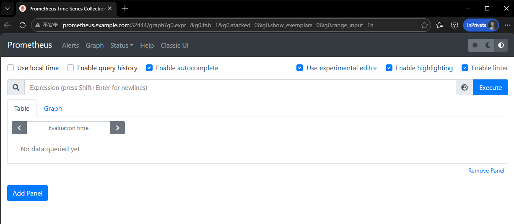

# Prometheus

## Prometheus介绍

Prometheus是一种开源的监控系统，最初由SoundCloud开发并于2012年发布。它是一种基于指标的监控系统，能够收集、存储和查询来自各种应用程序、服务和系统的度量数据。这些度量数据可以表示应用程序和系统的性能、健康状况和状态等信息。

Prometheus已经成为了云原生中指标监控的事实标准。它提供了一个灵活的数据模型和查询语言，支持多维度度量数据的聚合和图形化展示，使得开发人员和系统管理员能够快速地诊断和解决问题。此外，Prometheus还提供了一系列的工具和库，使得它可以轻松地与其他系统和服务集成。

## Kubernetes监控接口标准化

Kubernetes对监控接口进行了标准化，分为三类：

### 1. Resource Metrics

- **接口**: `metrics.k8s.io`
- **实现**: metrics-server
- **功能**: 提供节点、Pod、Namespace、Class级别的资源监控
- **类比Zabbix**: 类似基础监控项

### 2. Custom Metrics

- **接口**: `custom.metrics.k8s.io`
- **实现**: Prometheus
- **功能**:
  - 资源监控（与Resource Metrics有重叠）
  - 自定义监控（如应用级指标：在线人数、MySQL慢查询等）

### 3. External Metrics

- **接口**: `external.metrics.k8s.io`
- **实现**: 云厂商Provider
- **功能**: 云资源监控指标

## Prometheus架构

### 核心组件工作流程


### 组件详解

1. **Exporter**
   - 被监控对象提供的组件
   - 通过API暴露监控指标
   - 支持预定义和自定义Exporter
   - 示例：Node Exporter（主机监控）、Blackbox Exporter（网络监控）
2. **Prometheus Server**
   - 核心监控和告警平台
   - 定期从Exporter抓取指标数据
   - 存储到时间序列数据库（TSDB）
   - 执行查询和告警规则
3. **Pushgateway**
   - 提供网关地址接收外部推送数据
   - 适用于批处理任务或短生命周期任务
4. **Alertmanager**
   - 接收Prometheus的告警
   - 进行聚合、去重、降噪处理
   - 发送告警到指定目标
5. **Grafana**
   - 数据可视化平台
   - 配置Prometheus为数据源
   - 自定义仪表盘和警报

---

# 部署Prometheus

## Docker部署

实现快速测试、本地学习、熟悉UI、理解metrics

```bash
docker run --name prometheus -d -p 9090:9090 prom/prometheus:v3.9.1
```

### 查看配置

```bash
[root@docker200 ~]#docker exec -it prometheus sh
/prometheus $ ps -ef
PID   USER     TIME  COMMAND
    1 nobody    0:00 /bin/prometheus --config.file=/etc/prometheus/prometheus.yml --storage.tsdb.path=/prometheus
   22 nobody    0:00 sh
   27 nobody    0:00 ps -ef
/prometheus $ cat /etc/prometheus/prometheus.yml
# my global config
global:
  scrape_interval: 15s # Set the scrape interval to every 15 seconds. Default is every 1 minute.
  evaluation_interval: 15s # Evaluate rules every 15 seconds. The default is every 1 minute.
  # scrape_timeout is set to the global default (10s).

# Alertmanager configuration
alerting:
  alertmanagers:
    - static_configs:
        - targets:
          # - alertmanager:9093

# Load rules once and periodically evaluate them according to the global 'evaluation_interval'.
rule_files:
  # - "first_rules.yml"
  # - "second_rules.yml"

# A scrape configuration containing exactly one endpoint to scrape:
# Here it's Prometheus itself.
scrape_configs:
  # The job name is added as a label `job=<job_name>` to any timeseries scraped from this config.
  - job_name: "prometheus"

    # metrics_path defaults to '/metrics'
    # scheme defaults to 'http'.

    static_configs:
      - targets: ["localhost:9090"]
       # The label name is added as a label `label_name=<label_value>` to any timeseries scraped from this config.
        labels:
          app: "prometheus"
```

## kubernetes部署

### 步骤1：创建命名空间

```sh
kubectl create ns monitor
```

### 步骤2：创建ConfigMap挂载配置文件

prometheus.yml

```yaml
global:
  scrape_interval: 15s # Set the scrape interval to every 15 seconds. Default is every 1 minute.
  evaluation_interval: 15s # Evaluate rules every 15 seconds. The default is every 1 minute.
  # scrape_timeout is set to the global default (10s).

# Alertmanager configuration
alerting:
  alertmanagers:
    - static_configs:
        - targets:
          # - alertmanager:9093

# Load rules once and periodically evaluate them according to the global 'evaluation_interval'.
rule_files:
  # - "first_rules.yml"
  # - "second_rules.yml"

# A scrape configuration containing exactly one endpoint to scrape:
# Here it's Prometheus itself.
scrape_configs:
  # The job name is added as a label `job=<job_name>` to any timeseries scraped from this config.
  - job_name: "prometheus"

    # metrics_path defaults to '/metrics'
    # scheme defaults to 'http'.

    static_configs:
      - targets: ["localhost:9090"]
       # The label name is added as a label `label_name=<label_value>` to any timeseries scraped from this config.
        labels:
          app: "prometheus"
```

```sh
kubectl -n monitor create configmap prometheus-config --from-file=prometheus.yml
```

**验证**

```bash
[root@k8s-master-10 /kube/prometheus]#kubectl -n monitor get cm
NAME                DATA   AGE
kube-root-ca.crt    1      100s
prometheus-config   1      16s
```

### 步骤3：创建PV + PVC

pv-prometheus.yaml

```yaml
apiVersion: v1
kind: PersistentVolume
metadata:
  name: prometheus-nfs-pv
  labels:
    type: nfs
spec:
  capacity:
    storage: 20Gi  # PV 的容量
  volumeMode: Filesystem
  accessModes:
    - ReadWriteMany  # NFS 支持多节点同时读写
    - ReadWriteOnce    # 单节点读写
    - ReadOnlyMany     # 多节点只读
  persistentVolumeReclaimPolicy: Retain  # 删除 PVC 后保留数据
  storageClassName: ""
  mountOptions:
    - hard
    - nfsvers=4.1
  nfs:
    server: 10.0.0.31
    path: "/data/nfs"
```

pvc-prometheus.yaml

```yaml
apiVersion: v1
kind: PersistentVolumeClaim
metadata:
  name: prometheus
  namespace: monitor
spec:
  accessModes:
    - ReadWriteMany # 与pv的
  storageClassName: ""
  resources:
    requests:
      storage: 20Gi
```

#### StorageClass 动态存储供应

```bash
# 1.1 安装 NFS Provisioner
# 首先需要安装 NFS 客户端 provisioner：

# nfs-subdir-external-provisioner.yaml
apiVersion: v1
kind: Namespace
metadata:
  name: nfs-storage
---
apiVersion: v1
kind: ServiceAccount
metadata:
  name: nfs-client-provisioner
  namespace: nfs-storage
---
apiVersion: rbac.authorization.k8s.io/v1
kind: ClusterRole
metadata:
  name: nfs-client-provisioner-runner
rules:
  - apiGroups: [""]
    resources: ["persistentvolumes"]
    verbs: ["get", "list", "watch", "create", "delete"]
  - apiGroups: [""]
    resources: ["persistentvolumeclaims"]
    verbs: ["get", "list", "watch", "update"]
  - apiGroups: ["storage.k8s.io"]
    resources: ["storageclasses"]
    verbs: ["get", "list", "watch"]
  - apiGroups: [""]
    resources: ["events"]
    verbs: ["create", "update", "patch"]
---
apiVersion: rbac.authorization.k8s.io/v1
kind: ClusterRoleBinding
metadata:
  name: run-nfs-client-provisioner
subjects:
  - kind: ServiceAccount
    name: nfs-client-provisioner
    namespace: nfs-storage
roleRef:
  kind: ClusterRole
  name: nfs-client-provisioner-runner
  apiGroup: rbac.authorization.k8s.io
---
apiVersion: rbac.authorization.k8s.io/v1
kind: Role
metadata:
  name: leader-locking-nfs-client-provisioner
  namespace: nfs-storage
rules:
  - apiGroups: [""]
    resources: ["endpoints"]
    verbs: ["get", "list", "watch", "create", "update", "patch"]
---
apiVersion: rbac.authorization.k8s.io/v1
kind: RoleBinding
metadata:
  name: leader-locking-nfs-client-provisioner
  namespace: nfs-storage
subjects:
  - kind: ServiceAccount
    name: nfs-client-provisioner
    namespace: nfs-storage
roleRef:
  kind: Role
  name: leader-locking-nfs-client-provisioner
  apiGroup: rbac.authorization.k8s.io
---
apiVersion: apps/v1
kind: Deployment
metadata:
  name: nfs-client-provisioner
  namespace: nfs-storage
spec:
  replicas: 1
  selector:
    matchLabels:
      app: nfs-client-provisioner
  strategy:
    type: Recreate
  template:
    metadata:
      labels:
        app: nfs-client-provisioner
    spec:
      serviceAccountName: nfs-client-provisioner
      containers:
        - name: nfs-client-provisioner
          image: swr.cn-north-4.myhuaweicloud.com/ddn-k8s/k8s.gcr.io/sig-storage/nfs-subdir-external-provisioner:v4.0.2
          volumeMounts:
            - name: nfs-client-root
              mountPath: /persistentvolumes
          env:
            - name: PROVISIONER_NAME
              value: k8s-sigs.io/nfs-subdir-external-provisioner
            - name: NFS_SERVER
              value: 10.0.0.31  # 你的NFS服务器IP
            - name: NFS_PATH
              value: /data/nfs
      volumes:
        - name: nfs-client-root
          nfs:
            server: 10.0.0.31
            path: /data/nfs
# 1.2 创建 StorageClass
# storageclass-nfs.yaml

apiVersion: storage.k8s.io/v1
kind: StorageClass
metadata:
  name: nfs
  annotations:
    storageclass.kubernetes.io/is-default-class: "true"  # 设为默认存储类
provisioner: k8s-sigs.io/nfs-subdir-external-provisioner
parameters:
  archiveOnDelete: "false"  # 删除PV时是否存档数据
  pathPattern: "${.PVC.namespace}/${.PVC.name}"  # 在NFS服务器上创建子目录的格式
reclaimPolicy: Retain  # 或 Delete
volumeBindingMode: Immediate


# 应用配置：
kubectl apply -f nfs-subdir-external-provisioner.yaml
kubectl apply -f storageclass-nfs.yaml
```

```bash
# 2. 使用 StorageClass
# 2.1 创建 PVC（自动创建 PV）
# pvc-prometheus-dynamic.yaml
apiVersion: v1
kind: PersistentVolumeClaim
metadata:
  name: prometheus-dynamic
  namespace: monitor
spec:
  storageClassName: nfs  # 指定使用哪个StorageClass
  accessModes:
    - ReadWriteMany
  resources:
    requests:
      storage: 20Gi
# 2.2 在 Deployment 中使用
# deployment-prometheus.yaml
apiVersion: apps/v1
kind: Deployment
metadata:
  name: prometheus
  namespace: monitor
spec:
  replicas: 1
  selector:
    matchLabels:
      app: prometheus
  template:
    metadata:
      labels:
        app: prometheus
    spec:
      containers:
      - name: prometheus
        image: prom/prometheus:v2.45.0
        ports:
        - containerPort: 9090
        volumeMounts:
        - name: prometheus-data
          mountPath: /prometheus
      volumes:
      - name: prometheus-data
        persistentVolumeClaim:
          claimName: prometheus-dynamic
# 3. 验证动态供应
# 创建 PVC
kubectl apply -f pvc-prometheus-dynamic.yaml -n monitor
# 查看 PVC 状态（应该立即绑定）
kubectl get pvc -n monitor
# 查看自动创建的 PV
kubectl get pv
# 查看 PV 详情
kubectl describe pv <pv-name>
```

### 步骤4：创建Deployment

deployment-prometheus.yaml

```yaml
apiVersion: apps/v1
kind: Deployment
metadata:
  name: prometheus
  namespace: monitor
  labels:
    app: prometheus
spec:
  selector:
    matchLabels:
      app: prometheus
  template:
    metadata:
      labels:
        app: prometheus
    spec:
      serviceAccountName: prometheus
      initContainers:
      - name: "change-permission-of-directory"
        image: busybox
        command: ["/bin/sh"]
        args: ["-c", "chown -R 65534:65534 /prometheus"]
        securityContext:
          privileged: true
        volumeMounts:
        - mountPath: "/etc/prometheus"
          name: config-volume
        - mountPath: "/prometheus"
          name: data
      containers:
      - image: prom/prometheus:v2.28.0
        name: prometheus
        args:
        - "--config.file=/etc/prometheus/prometheus.yml"
        - "--storage.tsdb.path=/prometheus"
        - "--web.enable-lifecycle"
        ports:
        - containerPort: 9090
          name: http
        volumeMounts:
        - mountPath: "/etc/prometheus"
          name: config-volume
        - mountPath: "/prometheus"
          name: data
        resources:
          requests:
            cpu: 100m
            memory: 512Mi
          limits:
            cpu: 100m
            memory: 512Mi
      volumes:
      - name: data
        persistentVolumeClaim:
          claimName: prometheus
      - configMap:
          name: prometheus-config
        name: config-volume
```

### 步骤5：创建RBAC权限

rbac-prometheus.yaml

```yaml
apiVersion: v1
kind: ServiceAccount
metadata:
  name: prometheus
  namespace: monitor
---
apiVersion: rbac.authorization.k8s.io/v1
kind: ClusterRole
metadata:
  name: prometheus
rules:
- apiGroups:
  - ""
  resources:
  - nodes
  - services
  - endpoints
  - pods
  - nodes/proxy
  verbs:
  - get
  - list
  - watch
- apiGroups:
  - "extensions"
  resources:
    - ingresses
  verbs:
  - get
  - list
  - watch
- apiGroups:
  - ""
  resources:
  - configmaps
  - nodes/metrics
  verbs:
  - get
  
- nonResourceURLs:
  - /metrics
  verbs:
  - get
---
apiVersion: rbac.authorization.k8s.io/v1
kind: ClusterRoleBinding
metadata:
  name: prometheus
roleRef:
  apiGroup: rbac.authorization.k8s.io
  kind: ClusterRole
  name: prometheus
subjects:
- kind: ServiceAccount
  name: prometheus
  namespace: monitor
```

### 步骤6：创建Service和Ingress

svc-prometheus.yaml

```yaml
apiVersion: v1
kind: Service
metadata:
  name: prometheus
  namespace: monitor
spec:
  selector:
    app: prometheus
  type: ClusterIP
  ports:
    - name: web
      port: 9090
      targetPort: http
```

ingress-prometheus.yaml

```bash
apiVersion: networking.k8s.io/v1
kind: Ingress
metadata:
  name: prometheus
  namespace: monitor
spec:
  ingressClassName: nginx
  rules:
  - host: prometheus.example.com
    http:
      paths:
      - path: /
        pathType: Prefix
        backend:
          service:
            name: prometheus
            port:
              number: 9090
```

### 步骤7：部署所有资源

```sh
[root@k8s-master-10 /kube/prometheus]#ll
total 24
drwxr-xr-x 2 root root   28 Jan 28 19:36 config
-rw-r--r-- 1 root root 1438 Jan 28 18:24 deployment-prometheus.yaml
-rw-r--r-- 1 root root  345 Jan 28 19:35 ingress-prometheus.yaml
-rw-r--r-- 1 root root  206 Jan 28 18:22 pvc-prometheus.yaml
-rw-r--r-- 1 root root  442 Jan 28 19:24 pv-prometheus.yaml
-rw-r--r-- 1 root root  570 Jan 28 19:33 rbac-prometheus.yaml
-rw-r--r-- 1 root root  200 Jan 28 19:34 svc-prometheus.yaml
kubectl apply -f .
```

### 验证

```bash
[root@k8s-master-10 /kube/prometheus]#kubectl -n monitor get all
NAME                              READY   STATUS    RESTARTS      AGE
pod/prometheus-6497d6f8bc-qp9tx   1/1     Running   1 (10m ago)   11m

NAME                 TYPE        CLUSTER-IP    EXTERNAL-IP   PORT(S)    AGE
service/prometheus   ClusterIP   10.1.218.72   <none>        9090/TCP   15m

NAME                         READY   UP-TO-DATE   AVAILABLE   AGE
deployment.apps/prometheus   1/1     1            1           15m

NAME                                    DESIRED   CURRENT   READY   AGE
replicaset.apps/prometheus-6497d6f8bc   1         1         1       15m
[root@k8s-master-10 /kube/prometheus]#kubectl -n monitor get svc
NAME         TYPE        CLUSTER-IP    EXTERNAL-IP   PORT(S)    AGE
prometheus   ClusterIP   10.1.218.72   <none>        9090/TCP   15m
[root@k8s-master-10 /kube/prometheus]#kubectl -n monitor get pvc
NAME         STATUS   VOLUME              CAPACITY   ACCESS MODES   STORAGECLASS   AGE
prometheus   Bound    prometheus-nfs-pv   20Gi       RWX                           14m
[root@k8s-master-10 /kube/prometheus]#kubectl -n monitor  get ingress
NAME         CLASS   HOSTS                    ADDRESS     PORTS   AGE
prometheus   nginx   prometheus.example.com   10.0.0.11   80      21m
[root@k8s-master-10 /kube/prometheus]#kubectl -n ingress-nginx  get svc
NAME                                 TYPE        CLUSTER-IP     EXTERNAL-IP   PORT(S)                      AGE
ingress-nginx-controller             NodePort    10.1.46.56     <none>        80:32444/TCP,443:32443/TCP   3d3h
ingress-nginx-controller-admission   ClusterIP   10.1.122.188   <none>        443/TCP                      3d3h


[root@k8s-master-10 /kube/prometheus]#kubectl run --rm -it --image=busybox bash
/ # nslookup prometheus.monitor.svc.cluster.local
Server:		10.1.0.10
Address:	10.1.0.10:53 # DNS服务器 集群内部的 DNS 解析服务（CoreDNS/kube-dns）
Name:	prometheus.monitor.svc.cluster.local
Address: 10.1.218.72  # 拿到的服务IP地址
```

### 访问

```bash
# 域名解析
Ingress Controller 使用 NodePort
Ingress Controller 在所有节点上都有 NodePort 监听可以绑定任意节点的 IP
# 全部绑定（推荐）：
10.0.0.12 prometheus.example.com
10.0.0.11 prometheus.example.com
10.0.0.10 prometheus.example.com

[root@k8s-master-10 /kube/prometheus]#curl -v http://10.0.0.11:32444 -H "Host: prometheus.example.com"
* About to connect() to 10.0.0.11 port 32444 (#0)
*   Trying 10.0.0.11...
* Connected to 10.0.0.11 (10.0.0.11) port 32444 (#0)
> GET / HTTP/1.1
> User-Agent: curl/7.29.0
> Accept: */*
> Host: prometheus.example.com
> 
< HTTP/1.1 302 Found
< Date: Wed, 28 Jan 2026 13:32:44 GMT
< Content-Type: text/html; charset=utf-8
< Content-Length: 29
< Connection: keep-alive
< Location: /graph
> 
<a href="/graph">Found</a>.

* Connection #0 to host 10.0.0.11 left intact
```

浏览器访问32444端口



### 日志查看

```bash
kubectl -n ingress-nginx logs ingress-nginx-controller-594b5c5fcb-652qg -f

10.2.2.0 - - [28/Jan/2026:13:44:15 +0000] "GET /api/v1/query?query=time() HTTP/1.1" 200 103 "http://prometheus.example.com:32444/graph?g0.expr=&g0.tab=1&g0.stacked=0&g0.show_exemplars=0&g0.range_input=1h" "Mozilla/5.0 (Windows NT 10.0; Win64; x64) AppleWebKit/537.36 (KHTML, like Gecko) Chrome/144.0.0.0 Safari/537.36 Edg/144.0.0.0" 441 0.000 [monitor-prometheus-9090] [] 10.2.2.78:9090 103 0.000 200 c7c7dcea1ee8f3dcb76f453870a8e455
10.2.2.0 - - [28/Jan/2026:13:44:15 +0000] "GET /api/v1/label/__name__/values HTTP/1.1" 200 1480 "http://prometheus.example.com:32444/graph?g0.expr=&g0.tab=1&g0.stacked=0&g0.show_exemplars=0&g0.range_input=1h" "Mozilla/5.0 (Windows NT 10.0; Win64; x64) AppleWebKit/537.36 (KHTML, like Gecko) Chrome/144.0.0.0 Safari/537.36 Edg/144.0.0.0" 444 0.002 [monitor-prometheus-9090] [] 10.2.2.78:9090 1480 0.002 200 1fe400a44f9b633d6466cf75d6c31629s
```

---

# 配置

## 抓取时间

```bash
global:
  scrape_interval: 15s # Set the scrape interval to every 15 seconds. Default is every 1 minute.
  evaluation_interval: 15s # Evaluate rules every 15 seconds. The default is every 1 minute.
  # scrape_timeout is set to the global default (10s).
```

## 抓取目标

```bash
# A scrape configuration containing exactly one endpoint to scrape:
# Here it's Prometheus itself.
scrape_configs:
  # The job name is added as a label `job=<job_name>` to any timeseries scraped from this config.
  - job_name: "prometheus"

    # metrics_path defaults to '/metrics'
    # scheme defaults to 'http'.

    static_configs:
      - targets: ["localhost:9090"]
       # The label name is added as a label `label_name=<label_value>` to any timeseries scraped from this config.
        labels:
          app: "prometheus"
```

在这个配置中，`localhost:9090` ：

- **localhost**: Prometheus 容器内部
- **9090**: Prometheus 自己的 metrics 端点端口
- 返回 Prometheus 自身的 Go 运行时指标、HTTP 指标等

## 数据

```bash
# 举例 
curl -s  10.1.218.72:9090/metrics |tail -10
# TYPE prometheus_web_federation_warnings_total counter
prometheus_web_federation_warnings_total 0
# HELP promhttp_metric_handler_requests_in_flight Current number of scrapes being served.
# TYPE promhttp_metric_handler_requests_in_flight gauge
promhttp_metric_handler_requests_in_flight 1
# HELP promhttp_metric_handler_requests_total Total number of scrapes by HTTP status code.
# TYPE promhttp_metric_handler_requests_total counter
promhttp_metric_handler_requests_total{code="200"} 1039
promhttp_metric_handler_requests_total{code="500"} 0
promhttp_metric_handler_requests_total{code="503"} 0


这几个指标的解释：
prometheus_web_federation_warnings_total：表示由于与联邦的通信问题而发出的告警总数。
promhttp_metric_handler_requests_in_flight：表示当前正在处理的抓取请求的数量。
promhttp_metric_handler_requests_total：表示处理过的抓取请求的总数，按HTTP状态代码分类。
在 promhttp_metric_handler_requests_total 指标中，有三个标签 (code="200", code="500" 和 code="503") ，它们分别表示HTTP状态代码为200、500和503的请求总数。
注意，每个指标都有一个 TYPE 标签，它指定了指标的类型，例如 counter 或 gauge。
```


## 理解TSDB时序数据库

### 监控数据样本示例

```
# HELP promhttp_metric_handler_requests_total Total number of scrapes by HTTP status code.
# TYPE promhttp_metric_handler_requests_total counter
promhttp_metric_handler_requests_total{code="200"} 1039
promhttp_metric_handler_requests_total{code="500"} 0
promhttp_metric_handler_requests_total{code="503"} 0
```


### 关键概念

1. **指标类型**：

   - `counter`：计数器（只增不减）
   - `gauge`：测量器（可增可减）
   - `histogram`：柱状图
   - `summary`：采样点分位图统计

2. **指标格式**：

   ```
   <metric_name>{<label_name>=<label_value>, ...} <value> <timestamp>
   ```
   
   - `metric_name`：指标名称
   - `label`：标签（维度）
   - `value`：样本值（float64）
   - `timestamp`：时间戳（毫秒级）
   
3. **时间序列**：

   text

   ```
   ^
   │   . . . . . . . . . . . . . . . . .   node_cpu{cpu="cpu0",mode="idle"}
   │     . . . . . . . . . . . . . . . . . node_cpu{cpu="cpu0",mode="system"}
   v
   <------------------ 时间 ---------------->
   ```

   

### TSDB特点

- **高效存储检索**：快速处理大量时间序列数据
- **特定函数支持**：滑动窗口平均、最大最小值等
- **聚合操作**：支持数据聚合生成报告
- **数据保留策略**：可配置数据保留时间

# 流程总结

```bash
1. 服务暴露Metrics
应用通过HTTP协议暴露metrics端点
使用Prometheus client libraries生成指标

2. 配置监控
编写Prometheus配置文件
定义抓取目标（Targets）
配置抓取间隔和规则

3. 数据采集
Prometheus Server定期拉取metrics
支持服务发现自动发现目标
失败时发送警报

4. 数据存储
存储到本地TSDB
支持远程存储集成

5. 查询与可视化
使用PromQL查询语言
通过Grafana创建仪表盘

6. 告警与通知
定义告警规则
Alertmanager处理告警
发送到邮件、Slack等
```

# 核心理解

```bash
Prometheus功能定位：定期去Tragets列表拉取监控数据，存储到TSDB中，并且提供指标查询、分析的语句和接口。

Targets概念：要监控的目标对象（服务器、进程、容器等）
配置核心：scrape_configs定义抓取目标，static_configs配置静态目标
抓取机制：基于HTTP协议，默认15秒间隔
数据模型：指标 + 标签 + 时间戳 + 值 = 时间序列数据点
扩展性：通过Exporter支持各种系统监控，通过Pushgateway支持推送模式
```


# 与zabbix相比

在适用场景方面，Zabbix 更适合传统 IT 架构和中小规模的监控需求，尤其是在静态服务器和网络设备的监控中表现出色。Prometheus 则是云原生监控的首选，适合动态服务集群和大规模数据场景，尤其在 Kubernetes 和容器平台中具有显著优势。


