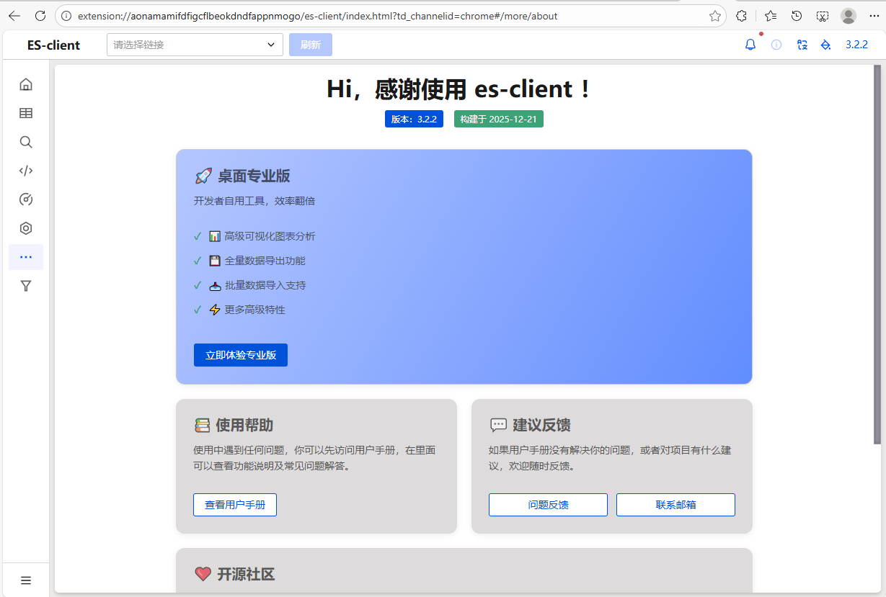

# Elasticsearch 基础指南

> Elasticsearch（ES）是一款开源的分布式搜索和分析引擎，基于 Apache Lucene 构建，提供 RESTful API。

**官方资源**：
- 官网：https://www.elastic.co/cn/
- 产品栈：https://www.elastic.co/cn/elastic-stack/
- Lucene 官网：https://lucene.apache.org/core/

---

## 一、为什么学习 ES

| 原因 | 说明 |
| :--- | :--- |
| **职业需求** | 运维、开发、大数据从业者必备技能 |
| **技术栈** | ELK 是日志分析的标准解决方案 |
| **性能优势** | 天然分布式，高性能搜索 |
| **易用性** | 无需深入 Java 即可维护 |
| **社区生态** | 强大的社区和商业支持 |

**应用场景**：搜索、日志分析、业务智能、安全分析、指标分析、性能监控

---

## 二、索引原理对比

| 索引类型 | 说明 | 示例 |
| :--- | :--- | :--- |
| **传统索引** | 类似书籍目录，通过目录→章节→页码的映射 | 目录→章节→页码 |
| **倒排索引** | 关键字→文档的映射 | Elasticsearch → 第一章、第二章 |

---

## 三、系统部署准备

### 1. 系统优化

```sh
# 清理 iptables
iptables -F
iptables -X
iptables -Z

# 检查 SELinux
getenforce  # 应为 Disabled

# 关闭 swap（生产环境建议）
swapoff -a
sed -i '/swap/s/^/#/' /etc/fstab
```

### 2. 安装 Elasticsearch 7.9.1

```sh
# 下载安装包
wget https://artifacts.elastic.co/downloads/elasticsearch/elasticsearch-7.9.1-x86_64.rpm

# 安装
rpm -ivh elasticsearch-7.9.1-x86_64.rpm

# 启动服务
systemctl daemon-reload
systemctl enable elasticsearch
systemctl start elasticsearch
```

**参考文档**：https://elasticsearch.bookhub.tech/set_up_elasticsearch/installing_elasticsearch/rpm

### 3. 配置文件优化

```sh
# 备份原配置
cp /etc/elasticsearch/elasticsearch.yml{,.ori}

# 生成新配置
cat > /etc/elasticsearch/elasticsearch.yml <<'EOF'
cluster.name: es1
node.name: devops01
network.host: 127.0.0.1,10.0.0.90
http.port: 9200
path.data: /var/lib/elasticsearch
path.logs: /var/log/elasticsearch
EOF
```

### 4. 内存锁配置

```sh
vim /usr/lib/systemd/system/elasticsearch.service

[Service]
LimitMEMLOCK=infinity
```

---

## 四、ES 核心概念总结

```sh
# ES 是一款强大的搜索引擎系统
# 基于它可以为用户提供搜索功能

# ELK Stack 被广泛应用于：
# - 搜索
# - 日志管理
# - 安全分析
# - 指标分析
# - 业务分析
# - 性能监控
```

```bash
# 编辑systemd配置
vim /usr/lib/systemd/system/elasticsearch.service

# 添加以下内容
[Service]
LimitMEMLOCK=infinity

# 重启服务
systemctl daemon-reload
systemctl restart elasticsearch
```

### **2.5 验证安装**

```
# 检查端口
netstat -tunlp | grep 9200

# 测试API
curl http://localhost:9200
{
  "name" : "devops01",
  "cluster_name" : "elasticsearch",
  "cluster_uuid" : "HZMHR1EyQRGIfrdezeHSfQ",
  "version" : {
    "number" : "7.9.1",
    "build_flavor" : "default",
    "build_type" : "rpm",
    "build_hash" : "083627f112ba94dffc1232e8b42b73492789ef91",
    "build_date" : "2020-09-01T21:22:21.964974Z",
    "build_snapshot" : false,
    "lucene_version" : "8.6.2",
    "minimum_wire_compatibility_version" : "6.8.0",
    "minimum_index_compatibility_version" : "6.0.0-beta1"
  },
  "tagline" : "You Know, for Search"
}
# 浏览器访问
```


### 2.6 数据写入

```bash
curl -X PUT 'http://10.0.0.90:9200/test_1/_doc/1' -H 'Content-Type: application/json' \
-d '{
    "name":"qwe",
    "age":"18"
}'
```

```bash
-X PUT：HTTP方法，这里是PUT请求
PUT：创建或更新资源
也可以使用 POST（创建）或 GET（查询）
# 自动生成ID（使用POST方法）  curl -X POST 'http://10.0.0.90:9200/test_1/_doc/'
http://10.0.0.90:9200/test_1/_doc/1：URL地址
10.0.0.90：Elasticsearch服务器IP地址
9200：ES的HTTP端口
test_1：索引名（类似MySQL中的"数据库名"）
_doc：文档类型（类似MySQL中的"表名"，ES 7.x后固定为_doc）
1：文档ID（类似MySQL中的"主键ID"）

-H 'Content-Type: application/json'：HTTP头，指定发送的数据格式为JSON

-d '...'：要发送的数据内容
```

```bash
# 1. 自动生成ID（使用POST方法）
curl -X POST 'http://10.0.0.90:9200/test_1/_doc/' \
  -H 'Content-Type: application/json' \
  -d '{"name":"abc", "age":"20"}'

# 2. 删除文档
curl -X DELETE 'http://10.0.0.90:9200/test_1/_doc/1'

# 3. 删除索引（删库）
curl -X DELETE 'http://10.0.0.90:9200/test_1'

# 4. 查看索引信息
curl -X GET 'http://10.0.0.90:9200/test_1'

# 5. 批量操作
curl -X POST 'http://10.0.0.90:9200/_bulk' \
  -H 'Content-Type: application/json' \
  -d '{"index":{"_index":"test_1","_id":"2"}}
{"name":"test2","age":"25"}
{"index":{"_index":"test_1","_id":"3"}}
{"name":"test3","age":"30"}'
```


## **第三部分：可视化工具**

### **3.1 Elasticsearch Head插件**

**三种安装方式：**

1. **Chrome插件**（推荐）：直接在Chrome商店安装  Elasticsearch

2. **Docker运行**：

   ```
   docker run -p 9100:9100 mobz/elasticsearch-head:7
   ```

3. **NPM安装**：需要Node.js环境




### **3.2 Kibana部署**

```
# 安装Kibana
get https://artifacts.elastic.co/downloads/kibana/kibana-7.9.1-x86_64.rpm
rpm -ivh kibana-7.9.1-x86_64.rpm

# 配置
cat > /etc/kibana/kibana.yml <<'EOF'
server.port: 5601
server.host: "10.0.0.90"
elasticsearch.hosts: ["http://10.0.0.90:9200"]
kibana.index: ".kibana"
EOF

# 启动
systemctl daemon-reload
systemctl start kibana
systemctl enable kibana
# 参考
# https://www.elastic.co/docs/deploy-manage/deploy/self-managed/install-kibana-with-rpm#rpm-repo
```


```bash
在Console控制台里读写es
```


## **第四部分：数据操作**

### **4.1 数据模型对比**

| MySQL    | Elasticsearch     | MongoDB    |
| :------- | :---------------- | :--------- |
| Database | Index             | Database   |
| Table    | Type（7.x后废弃） | Collection |
| Row      | Document          | Document   |
| Column   | Field             | Field      |
| Schema   | Mapping           | Schema     |
| SQL      | Query DSL         | MQL        |

```json
索引 = 数据库
只有一个"表" = _doc
每行字段可以不同（动态映射）
# 灵活的数据结构 日志系统示例：不同日志格式可以共存

// 无需预先定义表结构
// 直接插入数据，ES自动推断类型

// 第一次插入数字
PUT test/_doc/1
{
  "count": 100  // ES推断为long类型
}
// 第二次插入字符串（会报错！）
PUT test/_doc/2
{
  "count": "一百"  // 错误！类型冲突
}
```


### **4.2 增查改删CRUD操作**

**1. 创建数据（指定ID）**

```bash
# HTTP方式
curl -X PUT 'http://10.0.0.90:9200/linux_yu/_doc/1' \
  -H 'Content-Type: application/json' \
  -d '{"name":"qwe","website":"www.qwe.cn"}'

# http://10.0.0.90:5601/app/dev_tools#/console
PUT linux_yu/_doc/2
{
  "name": "asd",
  "website": "www.asd.cn"
}
```

**2. 创建数据（自动生成ID）**

```json
POST /test_1/_doc
{
  "name": "wang",
  "age": "19",
  "id": "123"
  "school": "1"
}
//  生成的ID是类似于  "_id" : "s-dZFJwBFPSCG9uAYJEd"  不同于手动指定的ID
```

**3. 查询数据**

```json
# 按ID查询
GET test_1/_doc/1

# 搜索所有文档
GET test_1/_search

# 条件查询
# match
GET test_1/_search
{
  "query": {
    "match": {
      "name": "qwe"  // name字段包含"qwe"
    }
  }
}
# term
GET test_1/_search
{
  "query": {
    "term": {
      "name": {
        "value": "qwe" 
      }
    }
  }
}
# terms
GET test_1/_search
{
  "query": {
    "terms": {
      "age": ["18", "29", "25"]  // age等于18、29或25
    }
  }
}
# range
GET test_1/_search
{
  "query": {
    "range": {
      "age": {
        "gte": 18,    // 大于等于18
        "lte": 30,    // 小于等于30
      }
    }
  }
}
```

**4. 复杂查询**

```yaml
# 多条件查询
GET t1/_search
{
  "query": {
    "bool": { # 布尔查询（组合多个条件）
      "must": [
        {"match": {"job": "ops"}}
      ],
      "filter": {
        "range": {
          "age": {
            "gt": 18,
            "lt": 30
          }
        }
      }
    }
  }
}
```

**5. 更新数据**

```json
# 更新指定ID（全量替换为新指定的内容）
PUT test_1/_doc/1
{
  "name": "chaoge01",
  "age": "18888"
}

# 部分更新
POST test_1/update/1
{
  "name": "chaoge02"
}
```

**6. 删除数据**

```
# 删除文档（相当于MySQL的一行数据）
DELETE test_2/_doc/1

# 删除索引（谨慎！）
DELETE t2/
```

**7.查看所有索引状态**

```bash
GET /_cat/indices?v&h=index,status,health,docs.count,store.size
```

## **第五部分：Kibana  UI界面使用**

### **5.1 创建索引模式**

1. **访问 Kibana** → Management → Index Patterns

2. 输入索引名称（如 `t1` 或 `t*`）

3. 选择时间字段（可选）

4. 创建索引模式

   

访问 10.0.0.90:5601


### **5.2 Discover功能**

- 实时数据浏览
- 添加过滤条件
- 字段统计
- 时间范围筛选


