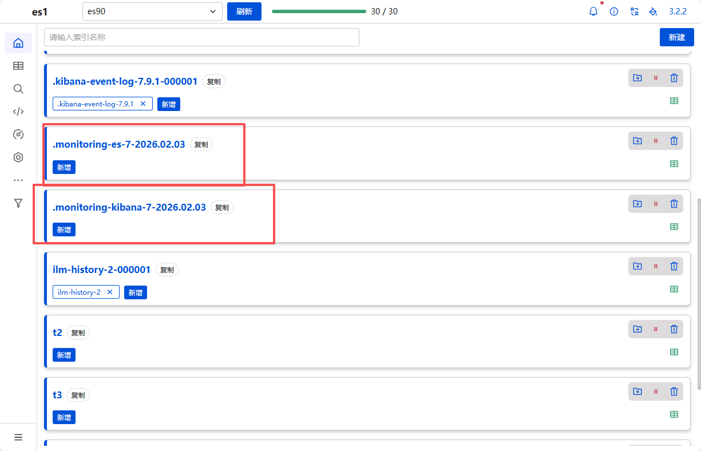

# 监控接口

## 常用监控接口

```
# 集群健康状态
http://10.0.0.90:9200/_cat/health

# 节点信息
http://10.0.0.90:9200/_cat/nodes

# 主节点信息
http://10.0.0.90:9200/_cat/master

# 索引信息
http://10.0.0.90:9200/_cat/indices

# 分片信息
http://10.0.0.90:9200/_cat/shards

# 指定索引分片信息
http://10.0.0.90:9200/_cat/shards/t2

_cat API 常见参数
参数	说明	示例
?v	显示详细格式，包括列标题	/_cat/nodes?v
?h	指定显示的列	/_cat/nodes?h=name,ip,cpu
?help	显示帮助信息	/_cat/nodes?help
?format	指定输出格式（json, yaml等）	/_cat/nodes?format=json
```

## 脚本监控示例

```bash
# 判断集群是否健康
curl -s 10.0.0.90:9200/_cat/health | grep 'green' | wc -l
# 集群节点信息   ?v显示详细格式
curl -s 10.0.0.90:9200/_cat/nodes?v
# 统计ES节点数量
curl -s 10.0.0.90:9200/_cat/nodes | wc -l
```

#  Kibana监控管理

## UI

### 开启监控


### es集群信息


### 节点状态


### kibana生成的监控数据

```bash
kibana获取监控数据，写入es，然后kibana再读。
10s采集区间。
```



```bash
.monitoring-es-7-{日期}
用途：存储 Elasticsearch 集群的监控数据
包含的数据类型：
GET .monitoring-es-7-2026.02.03/_search
{
  "size": 1,
  "_source": ["type", "cluster_name", "timestamp"]
}
具体包含的指标：
1. 集群级别指标
   - 集群状态（green/yellow/red）
   - 节点数量
   - 分片数量
   - 未分配分片数
   - 文档总数
   - 索引总数
2. 节点级别指标
   - JVM 堆内存使用率
   - 系统内存使用率
   - CPU 使用率
   - 磁盘使用情况
   - 网络流量
   - 线程池状态
   - 垃圾回收统计
3. 索引级别指标
   - 索引大小
   - 文档数量
   - 索引/查询吞吐量
   - 索引/查询延迟
   - 分片统计
4. 分片级别指标
   - 分片状态
   - 文档数量
   - 存储大小
   - 索引/查询操作数
   
.monitoring-kibana-7-{日期}
用途：存储 Kibana 实例的监控数据
包含的数据类型：
GET .monitoring-kibana-7-2026.02.03/_search
{
  "size": 1,
  "_source": ["kibana", "process", "os"]
}
具体包含的指标：

1. Kibana 实例信息
   - 版本号
   - 实例名称/UUID
   - 运行状态
2. 进程指标
   - 内存使用（RSS、堆内存）
   - CPU 使用率
   - 正常运行时间
   - 响应时间
3. 请求统计
   - HTTP 请求总数
   - 响应时间分布
   - 错误率
   - 并发连接数
4. 搜索性能
   - Elasticsearch 查询次数
   - 平均查询时间
   - 查询失败率
5. 系统资源
   - 内存使用情况
   - CPU 负载
   - 磁盘空间
```


## Console

在 Kibana 的 Dev Tools Console 里，**不写完整的 URL**，只写 API 路径部分。

- Kibana 的 Console 会自动连接到你在 `kibana.yml` 中配置的 Elasticsearch
- 不需要指定主机和端口

### 查看监控状态

```json
GET /_cluster/settings
########结果如下
{
  "persistent" : {
    "xpack" : {
      "monitoring" : {
        "collection" : {
          "enabled" : "true"
        }
      }
    }
  },
  "transient" : { }
}
```

### 关闭监控

```
PUT /_cluster/settings
{
  "persistent": {
    "xpack": {
      "monitoring": {
        "collection": {
          "enabled": "false"
        }
      }
    }
  }
}
```

**注意**: 关闭监控后可以删除监控数据索引.monitoring-es-7-2026.02.03 .monitoring-es-7-2026.02.03