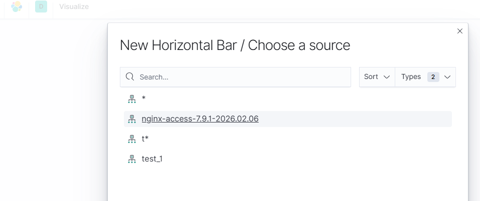
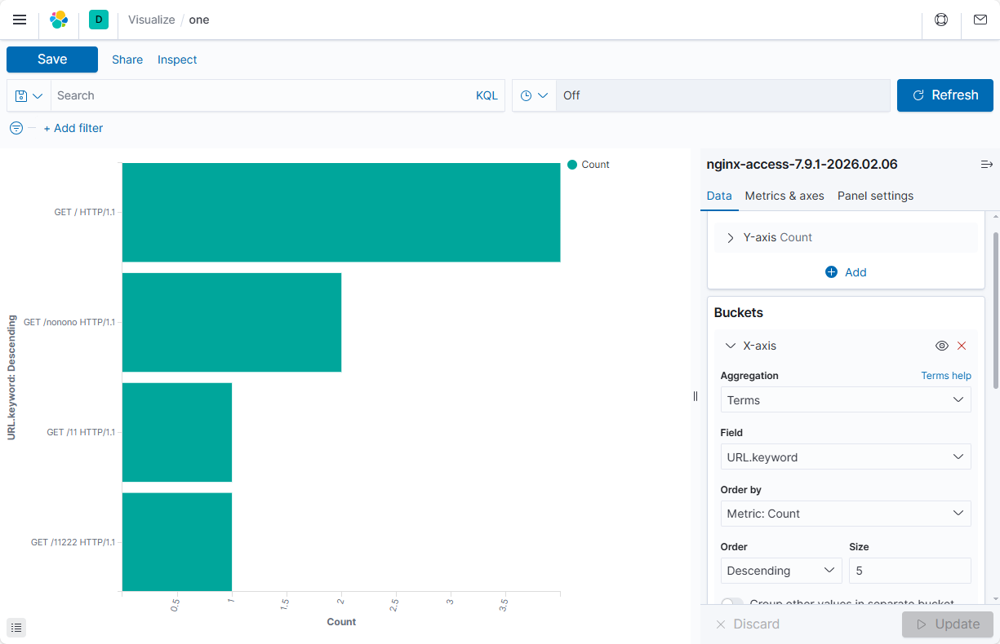
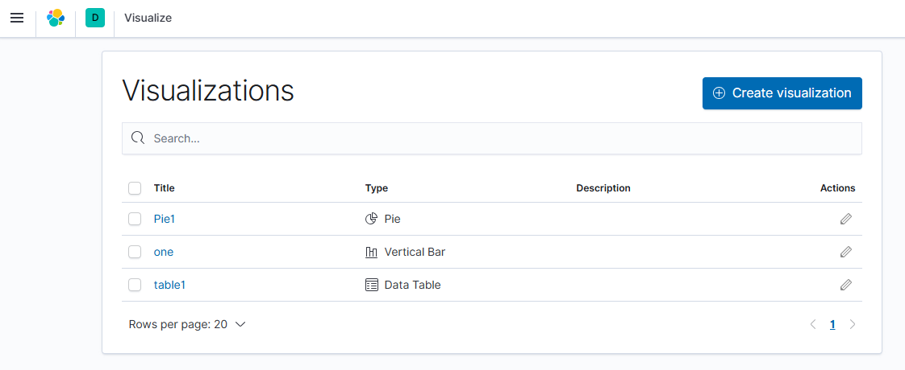

# Kibana可视化

## 一、创建索引模式

登录Kibana后，首先需要创建索引模式来指定要查询的Elasticsearch索引。

---

## 二、可视化

### 2.1 Visualize入口

进入Kibana的Visualize页面，可以创建各种可视化图表。

### 2.2 Horizontal Bar图形模式

选用Horizontal Bar柱状图进行数据展示。

#### 选取目标索引模式

选择要可视化的索引模式。

#### XY轴图形数据

配置X轴和Y轴的数据字段，更新并保存配置。

### 2.3 Data Table图形

使用表格形式展示数据。

### 2.4 Pie图形

使用饼图展示数据占比。

---

## 三、可视化Visualizations

保存下来的可视化图表可以在Visualizations页面查看和管理。

---

## 四、Dashboard

Dashboard可以将多个可视化内容组合成一个可视化仪表板，方便统一查看和分析。

设计好Dashboard后可以保存，方便后续使用。

---

## 五、总结

Kibana提供了强大的可视化功能，支持多种图表类型和仪表板管理。通过合理配置索引模式、创建可视化图表和组合Dashboard，可以直观地展示和分析日志数据，帮助运维人员快速发现问题和趋势。

> 下一步：学习更多运维技术，构建完整的运维知识体系。
